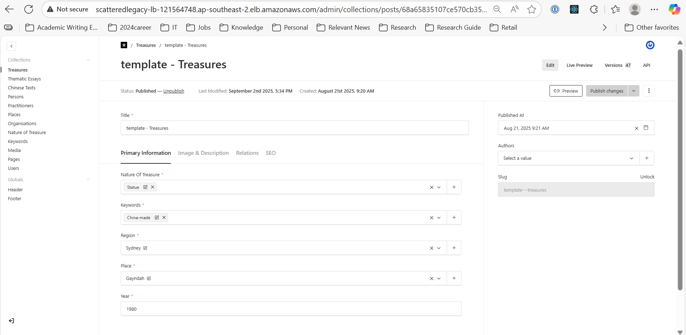

# ScatteredLegacy

ScatteredLegacy is a full-stack web application comprising a website and a content management system (CMS). It is designed to showcase historical items related to Chinese-Australian heritage.

## Website
http://scatteredlegacy-lb-121564748.ap-southeast-2.elb.amazonaws.com/

## Technical Stack 

### Frontend
- React
- Next.js
- Node.js

### Backend
- Next.js

### Database
- MongoDB Atlas

### Infranstructure
- Amazon Web Services (AWS)

## Techincal Overview
- The application is hosted on AWS ECS (Elastic Container Service)
- Data is stored in MongoDB Atlas
- Media assets (images, videos, PDFs) are stored in an AWS S3 bucket
- Search functionality is powered by Algolia

## Infrastructure Hosting Cost
Approximately AUD $50/month under low traffic conditions and database size below 5 GB.

## Deployment Instructions
Continuous integration and deployment (CI/CD) are managed via GitHub Actions.
The pipeline handles automated building and deployment to AWS infrastructure.

## Usage Guidelines

The application features an integrated Admin Panel for content management.

- To access the Admin Panel, click the "Admin" button located in the bottom-right corner of the homepage.
- Through the Admin Panel, authorized users can add, edit, and manage various types of content, including treasures, essays, persons, places, organisations, and associated media files.

Additionally, a search function is available via the button in the top-right corner of the homepage. Users can use this feature to search and filter content efficiently.

### Admin Panel Screenshots

## Contributor Info
Mu Zhang
mu.zhang-jobs@hotmail.com